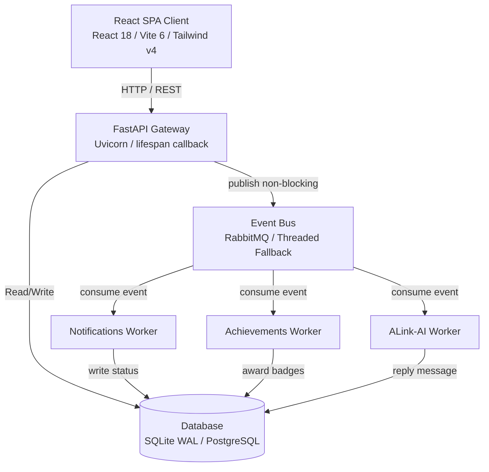

# ALink Project — Last-Moment Architectural Analysis & Audit

This document provides a comprehensive technical overview and audit of the **ALink (Alumni-to-Student Career Network)** codebase. It outlines the core system architecture, database schema design, background event-driven microservices, machine learning recommendation systems, security implementations, and areas of technical debt with recommendations for production hardening.

---

## 🏗️ 1. System Architecture

ALink is built as a decoupled, full-stack web application following a modular architecture:



### Frontend Stack
* **Core:** React 18, Vite 6, TypeScript.
* **Routing:** React Router v7. Includes route guards (`RequireAuth`) and admin restrictions (`AdminGate`).
* **Styling & Layout:** Tailwind CSS v4 (leveraging `@tailwindcss/vite` compiler integration) and Radix UI primitives.
* **Graphics & Visuals:** Recharts for admin/dashboard data representation; Framer Motion (`motion`) for micro-animations and page transitions.

### Backend Stack
* **Core:** FastAPI (served via Uvicorn with a file-watching auto-reloader).
* **ORM:** SQLAlchemy 2.0 (declarative mapping via Mapped/mapped_column types).
* **Lifespan Manager:** Handles automatic schema migration (`create_all`), folder creation, and database seeding (`seed_if_empty`) on boot.

---

## 🗃️ 2. Database Schema & ORM Mapping

ALink uses **SQLAlchemy 2.0** declarative mapping. The schema is optimized for a relational design and handles local SQLite (WAL mode enabled) and production PostgreSQL seamlessly.

### Core Tables & Models

1. **`User` (`users`)**
   * Fields: `id`, `email`, `password_hash`, `name`, `role` (student/alumni/admin), `title`, `company`, `university`, `major`, `skills` (JSON array), `verified` (bool), `token_version` (int).
   * **Key Pattern:** `token_version` is incremented upon password reset, instantly invalidating old JWT tokens at the auth dependency gate.

2. **Connections & Networking**
   * **`Connection` (`connections`):** Bidirectional association tracking connections with a `UniqueConstraint("a_id", "b_id")`.
   * **`ConnectionRequest` (`connection_requests`):** Tracks warm-intro requests (`pending`, `accepted`, `declined`).

3. **Appointments & Referrals**
   * **`Booking` (`bookings`):** Mentorship slots containing calendar dates, times, `starts_at_utc` for timezone compatibility, and duration.
   * **`Referral` (`referrals`):** Referral logs linking students to alumni referrers, tracking statuses: `submitted`, `under_review`, `forwarded`, `declined`.

4. **Job Board**
   * **`Job` (`jobs`):** Job listings posted by alumni, with fields like role, salary, location, type, and verification status (`live`, `pending`, `flagged`).
   * **`JobLike` (`job_likes`) & `JobComment` (`job_comments`):** Interactive features. JobComment supports threaded comments with self-referencing hierarchical relationships (`parent_id` linking back to `job_comments.id`).

5. **Gamification & Verification**
   * **`Achievement` (`achievements`) & `UserAchievement` (`user_achievements`):** Tracks student milestones and ranks rarity.
   * **`Verification` (`verifications`) & `VerificationSubmission` (`verification_submissions`):** Manages student ID card and resume uploads for directory verification.

---

## 📡 3. Event-Driven Messaging Architecture

The application decouples heavy background processes (notifications, AI generation, achievements) from the REST request lifecycle using an event-driven publish-subscribe pattern.

```
Request Pathway ──────────────────────────────▶ [Event Queue] ──▶ [Publisher Thread]
(e.g., POST /connections/accept)                    │                  │
                                                    ▼                  ▼
                                              (RabbitMQ Active)   (Local Fallback)
                                                    │                  │
                                                    ▼                  ▼
                                             Durable Exchange   In-Process Handlers
```

* **Non-Blocking Publishing:** When an action occurs (e.g., connection accepted, job posted), the router calls `publish(...)`. This is non-blocking; the event is appended to an in-memory thread-safe `queue.Queue` (cap: 10,000) and drained by a background daemon publisher thread (`alink-event-publisher`).
* **RabbitMQ Connection:** If a broker is configured, the publisher thread connects via `pika.BlockingConnection` and publishes persistent events to `alink.events`.
* **Graceful Fallback:** If RabbitMQ is unavailable or `pika` is missing, the publisher thread catches the failure and dispatches the event **in-process** via synchronous event handlers, maintaining full system functionality in zero-config development environments.

---

## 🤖 4. Machine Learning Implementation

ALink features three core ML features located in `backend/app/ml/`:

### ML-1: People Recommender (`recommend_people`)
Generates matches between students and alumni using a hybrid content-collaborative filtering scoring system:
1. **Content Overlap:** Builds a weighted profile document (giving 3x weight to skills, plus major, industry, title, company, university, and bio) and calculates cosine similarity using **TF-IDF**.
2. **Collaborative Boosts:** Combines content scores with heuristic boosts:
   * **Same University:** $+0.12$
   * **Shared Industry:** $+0.06$
   * **Open to Mentoring:** $+0.06$
   * **Verified Candidate:** $+0.04$
   * **Mutual Connections:** Multiplied by the Jaccard coefficient of shared connections $\times\ 0.15$.
3. **Score Blending:** Final score = $\min(1.0, \text{content} \times 0.7 + \text{boosts})$.

### ML-2: Job Recommender (`recommend_jobs`)
Recommends jobs to students based on profile similarity, popularity, and recency:
1. **Profile Overlap:** Cosine similarity of the student profile against the job description (role, company, type, tags).
2. **Popularity Prior:** A log-scaled count of likes and comments normalized across active roles:
   $$\text{Popularity} = \frac{\ln(1 + \text{likes} + \text{comments})}{\max(\text{Popularity}_{\text{raw}})}$$
3. **Recency Decay:** Mild exponential decay based on the posting date (half-life of $\approx 30$ days):
   $$\text{Decay} = e^{-\Delta\text{days} / 43}$$
4. **Blend:** $\min(1.0, \text{content} \times 0.75 + \text{popularity} \times 0.20 + \text{recency} \times 0.05)$.

### ML-3: AI Intent Classifier (`classify` & `generate_reply`)
Classifies user DMs to the AI assistant to route queries to appropriate templates:
* **Feature Extraction:** Character + word n-gram TF-IDF vectorization (character n-grams absorb typing mistakes).
* **Cosine Matching:** Nearest-neighbor search against training utterances.
* **Confidence Threshold:** If the cosine similarity is below `0.35`, the query falls back to a generic helper response.
* **Graceful Fallback:** When `scikit-learn` is missing, both recommenders and intent classifiers fall back to pure-Python Jaccard tokenizers so the system never crashes.

---

## 🔐 5. Security & Authentication Controls

* **Password Hashing:** Uses `bcrypt` hashing on user registration and password updates.
* **JWT Tokens:** Authenticates sessions via HS256 JWT bearer tokens containing the user ID, role, and current `token_version`.
* **State Invalidation:** Fast invalidation checks are performed at the auth injection gate (`deps.get_current_user`). If a user resets their password, database `token_version` increments, and any old token payload fails comparison, forcing a re-login.
* **Access Control Lists (ACL):** Frontend paths check user contexts. Backend routes use FastAPI dependency injection (`RequireRole`) to enforce role safety.

---

## 📈 6. Technical Gaps & Recommendations

While the project codebase is highly robust and clean, the following architectural upgrades are recommended for production scalability:

1. **Transition to Asynchronous Database Operations**
   * *Debt:* The current backend uses synchronous SQLAlchemy sessions (`Session`) which block the event loop during database IO operations.
   * *Fix:* Migrate to standard asynchronous sessions (`AsyncSession`) with async database drivers (e.g., `asyncpg` for PostgreSQL, `aiosqlite` for SQLite). This will significantly increase throughput under concurrent traffic.

2. **Asynchronous AMQP Client**
   * *Debt:* The event publisher and workers utilize `pika`'s `BlockingConnection`, forcing the use of background daemon threads to prevent HTTP thread blocking.
   * *Fix:* Transition the event bus to `aio-pika` (or `pika`'s async adapters), integrating directly with FastAPI's native `asyncio` event loop.

3. **Database Lock Mitigation**
   * *Debt:* Under local SQLite configurations, concurrent writes (e.g., simultaneous chat messages and notifications) can occasionally lead to database lock errors despite WAL mode.
   * *Fix:* Ensure a retry mechanism is configured on database write commits, or fully decouple the local dev database onto a Dockerized PostgreSQL container.

4. **Test Coverage**
   * *Debt:* There is no structured automated testing suite currently visible in the main directories.
   * *Fix:* Implement `pytest` for backend API routing, database migrations, and ML recommender score verifications, alongside `Vitest` / React Testing Library for frontend component testing.
